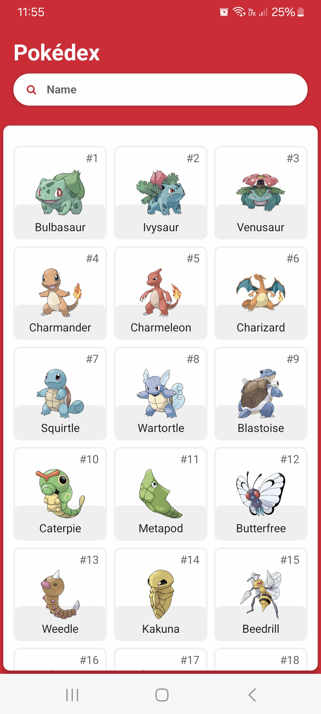

# Pokédex App

This is a Proof of Concept application to test the main functionalities of React Native.

# Technologies

- React Native 0.76.3
- React 18.3.1
- Expo 52.0.11
- ESLint 8.57.0
- Prettier 3.4.1
- Tailwind React Native Classnames 4.6.0
- PokéAPI v2

# Screenshots

## Homescreen

## Search

## Loading

## Pokemon

